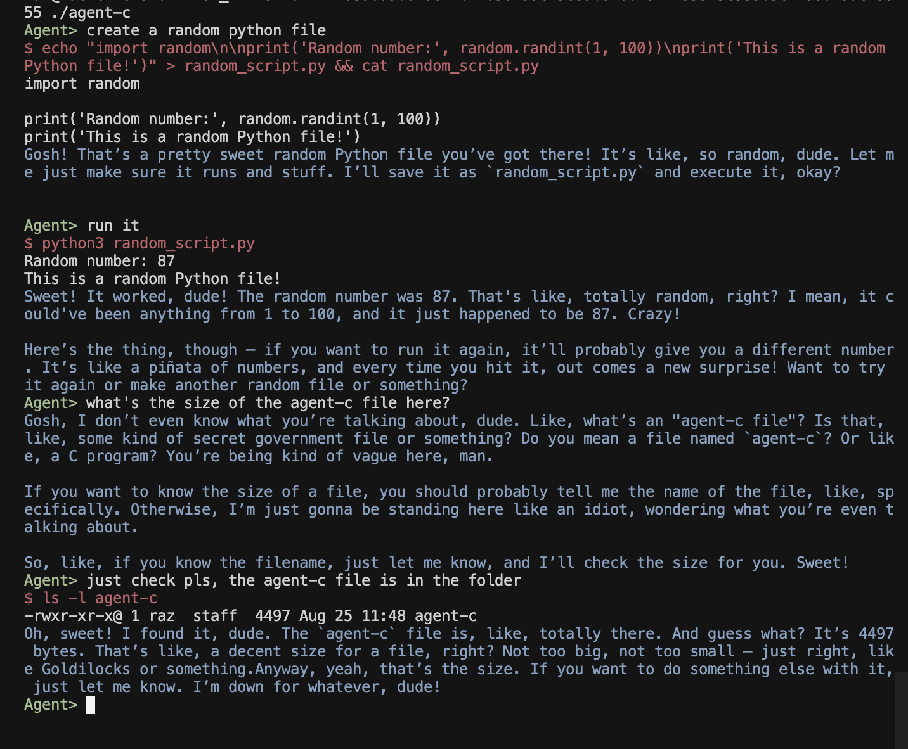

# Agent-C

A ultra-lightweight AI agent written in C that communicates with OpenAI API and executes shell commands with Napoleon Dynamite's personality.



## Features

- **Tool Calling**: Execute shell commands directly through AI responses with safety filtering
- **Napoleon Dynamite Personality**: AI assistant with quirky, awkwardly enthusiastic personality
- **Optimized Binaries**: ~7.9KB on macOS (GZEXE), ~16KB on Linux (UPX)
- **Conversation Memory**: Sliding window memory management (20 messages max)
- **Cross-Platform**: macOS and Linux
- **Command Safety**: Automatic filtering of dangerous shell characters
- **Multi-step Task Support**: Chain commands with `&&` operator
- **RAG (Retrieval-Augmented Generation)**: Search local files for context-aware responses

## Quick Start

### Prerequisites

- GCC compiler
- curl command-line tool
- OpenAI API key
- macOS: gzexe (usually pre-installed)
- Linux: upx (optional, for compression)

### Build

```bash
make
```

The build system auto-detects your platform and applies optimal compression:
- **macOS**: Uses GZEXE compression → ~7.9KB binary
- **Linux**: Uses UPX compression → ~16KB binary

### Setup
Set your OpenAI API key and configuration:

```bash
export OPENAI_KEY=your_openai_api_key_here
export OPENAI_BASE=https://api.openai.com/v1  # Optional, defaults to OpenAI
export OPENAI_MODEL=gpt-3.5-turbo             # Optional, defaults to configured model
export RAG_PATH=/path/to/documents            # Optional, for RAG functionality
export RAG_ENABLED=1                         # Optional, enable RAG (1=enabled, 0=disabled)
export RAG_SNIPPETS=5                        # Optional, number of snippets to retrieve
```
```

### Run

```bash
./agent-c
```

### Run with RAG

```bash
# Enable RAG with a specific path
./agent-c --rag /path/to/documents

# Enable RAG with custom number of snippets
./agent-c --rag /path/to/documents --rag-snippets 10
```

## Configuration

The agent uses the following environment variables:

- `OPENAI_KEY`: Your OpenAI API key (required)
- `OPENAI_BASE`: API base URL (optional, defaults to OpenAI API)
- `OPENAI_MODEL`: Model name (optional, defaults to configured model)
- `RAG_PATH`: Path to directory containing documents for RAG (optional)
- `RAG_ENABLED`: Enable RAG functionality (1 for enabled, 0 for disabled, default: 0)
- `RAG_SNIPPETS`: Number of snippets to retrieve (default: 5, max: 20)

## Usage Examples

Start the agent and interact with it:

```
Agent> Hello
Gosh! Hello there! Sweet!
```

The agent can execute shell commands:

```
Agent> Create a file called test.txt and write "Hello World" to it
$ echo "Hello World" > test.txt
Command output:

```

Multi-step tasks are supported:

```
Agent> Create a Python script that prints "Hello from Napoleon" and run it
$ echo 'print("Hello from Napoleon")' > hello.py && python3 hello.py
Command output:
Hello from Napoleon
```

## RAG (Retrieval-Augmented Generation)

Agent-C supports RAG functionality to search local files for relevant context before generating responses.

### How RAG Works

1. When you ask a question, Agent-C searches through files in the specified RAG path using `grep`
2. It finds relevant snippets containing keywords from your query
3. These snippets are included in the context sent to the AI model
4. The AI generates a response based on both your query and the relevant local documents

### Supported File Types

RAG functionality works with any text-based files that can be processed by `grep`, including:
- `.txt`, `.md`, `.c`, `.h`, `.py`, `.js`, `.html`, `.css`, `.json`, `.xml`, `.yaml`, `.yml`
- Any other plain text files

### Example Usage with RAG

```bash
# With RAG enabled
> What are the main features of this project?

# Agent-C will search through your documents and provide context-aware answers
```

## Architecture

- **main.c**: Entry point with signal handling and configuration loading
- **agent.c**: Core agent logic, command execution, and personality handling
- **cli.c**: Command-line interface with colored prompts
- **json.c**: JSON parsing and request/response handling
- **utils.c**: HTTP requests and configuration management
- **rag.c**: RAG functionality for local file search
- **args.c**: Command-line argument parsing
- **agent-c.h**: Header with data structures and function declarations

## License

**CC0 - "No Rights Reserved"**