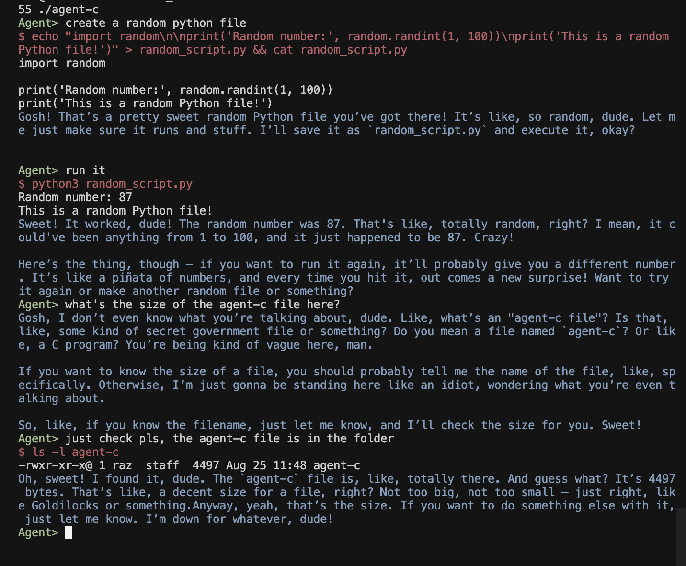

# Agent-C

A ultra-lightweight AI agent written in C that communicates with OpenRouter API and executes shell commands.



## Features

- **Tool Calling**: Execute shell commands directly through AI responses
- **Optimized Binaries**: 4.4KB on macOS (GZEXE), ~16KB on Linux (UPX)
- **Conversation Memory**: Sliding window memory management for efficient operation
- **Cross-Platform**: macOS and Linux

## Quick Start

### Prerequisites

- GCC compiler
- curl command-line tool
- OpenRouter API key
- macOS: gzexe (usually pre-installed)
- Linux: upx (optional, for compression)

### Build

```bash
make
```

The build system auto-detects your platform and applies optimal compression:
- **macOS**: Uses GZEXE compression → 4.4KB binary
- **Linux**: Uses UPX compression → ~16KB binary

### Setup

Set your OpenRouter API key:

```bash
export OR_KEY=your_openrouter_api_key_here
```

### Run

```bash
./agent-c
```

## License

**CC0 - "No Rights Reserved"**